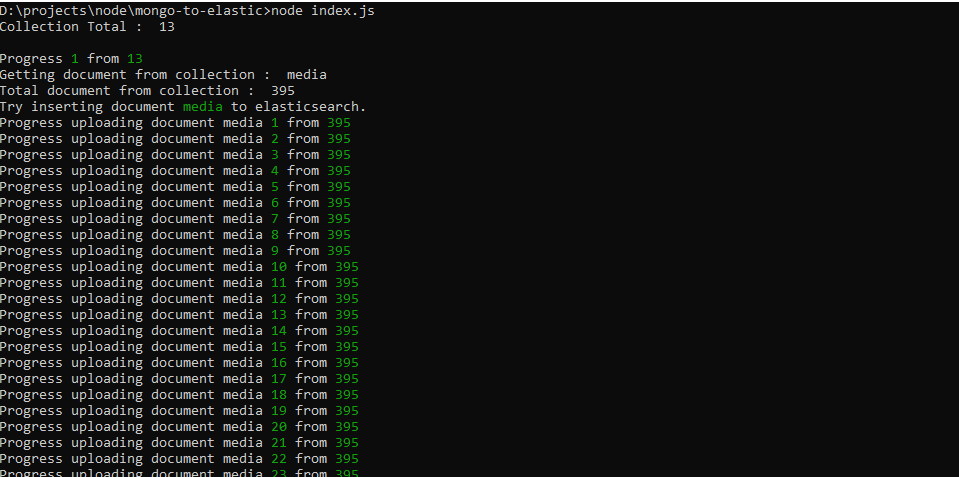
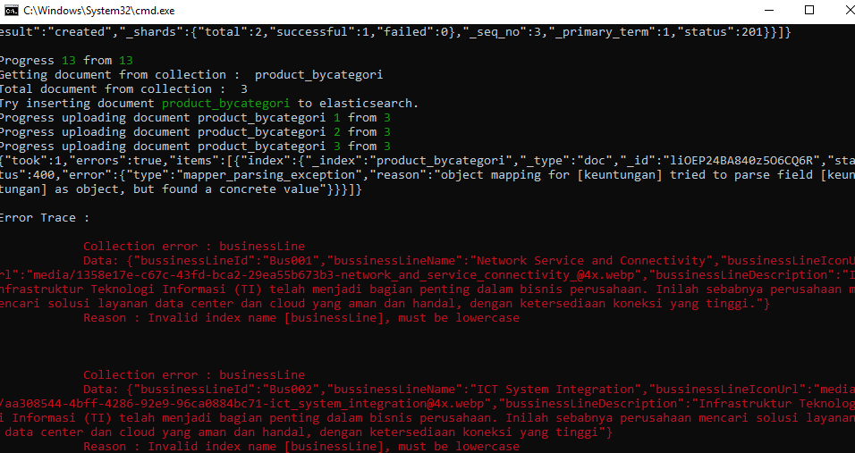

# Mongo To Elastic




Configuration

  - change ```const url = '' ``` to your mongodb connection url
  - change ```host:``` inside ```elasticsearch.client``` to your elasticsearch host

### Installation

requires [Node.js](https://nodejs.org/) v8+ to run.

```sh
$ cd mongo-to-elastic
$ npm install 
$ node index.js
```

```MD 
Example progress : 
Progress 10 from 13
Getting document from collection :  tags
Total document from collection :  22
Try inserting document tags to elasticsearch.
```


